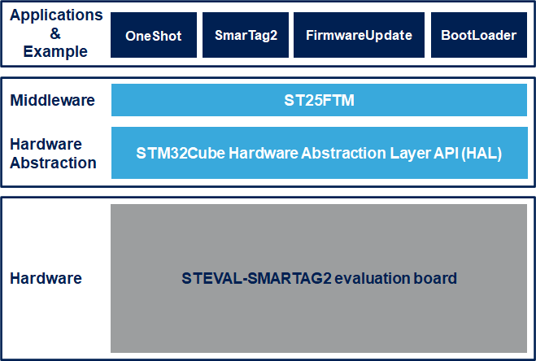

# FP-SNS-SMARTAG2 Firmware Package

The FP-SNS-SMARTAG2 contains the following projects:

- Example:

  - SimpleBootLoader: apply the firmware updated replacing the current running firmware with the new version received via NFC or runs the current firmware if the new version is not available.

  - SmarTag2: reads the ambient light, motion and environmental sensor data on your IoT node by the means of an NFC enabled reader, such as a mobile phone or tablet, throught a suitable AndroidST or iOST application such as the ST Asset Tracking (Version 3.1.0 or higher) and ST NFC Sensor (Version 1.3.0 or higher). .

- Applications:

  - FirmwareUpdate: it saves the new firwmare received via NFC using the ST FTM protocol and saves it on the right flash region and works with the SimpleBootLoader example for enabling the Firmware Update capability

The package supports battery operated use cases.

**FP-SNS-SMARTAG2 software features**:

- Complete firmware to access data from an IoT node with dynamic NFC tag, environmental, motion and ambient light sensors 

- Ultra-low power operations, with support battery operated use cases

- Compatible with the STAssetTracking application for Android/iOS for reading data logs from the NFC tag and for sending them to the DSH-ASSETRACKING cloud-based dashboard

- Sample implementation available for the STEVAL-SMARTAG2 evaluation board

- Easy portability across different MCU families, thanks to STM32Cube

This firmware package includes Components Device Drivers, Board Support Package and example application for the STMicroelectronics:

- STEVAL-SMARTAG2 (SmarTag2) evaluation board that contains the following components:
  - MEMS sensor devices (LPS22DF, STTS22H, LIS2DUX12, H3LIS331DL, LSM6DSO32X)
  - ambient light sensors(VD6283TX)
  - dynamic NFC tag (ST25DV64KC)

Here is the list of references to user documents:

- [DB4770 NFC dynamic tag sensor and processing node evaluation board](https://www.st.com/resource/en/data_brief/steval-smartag2.pdf)
- [UM3034 Getting started with the STEVAL-SMARTAG2 NFC dynamic tag sensor and processing node evaluation board](https://www.st.com/resource/en/user_manual/um3034-getting-started-with-the-stevalsmartag2-nfc-dynamic-tag-sensor-and-processing-node-evaluation-board-stmicroelectronics.pdf)
- [DB4817 STM32Cube function pack for IoT node with Dynamic NFC Tag, environmental, motion and ambient light sensors](https://www.st.com/resource/en/data_brief/FP-SNS-SMARTAG2.pdf)
- [UM3073 Getting started with the STM32Cube function pack for IoT node with Dynamic NFC Tag, environmental, motion and ambient light sensors](https://www.st.com/resource/en/user_manual/um3073-getting-started-with-the-stm32cube-function-pack-for-stevalsmartag2-evaluation-board-with-dynamic-nfc-tag-environmental-motion-and-ambient-light-sensors-stmicroelectronics.pdf)
- [FP-SNS-SMARTAG2 Quick Start Guide](https://www.st.com/resource/en/product_presentation/fp-sns-smartag2-quick-start-guide.pdf)

## Supported Devices and Boards

- STEVAL-SMARTAG2 NFC Dynamic Tag sensor node evaluation board \[[STEVAL-SMARTAG2]()\]

## Development Toolchains and Compilers

-   IAR Embedded Workbench for ARM (EWARM) toolchain V9.20.1 + STLink/V2
-   RealView Microcontroller Development Kit (MDK-ARM) toolchain V5.37.0 + ST-LINK/V2
-   Integrated Development Environment for STM32 (STM32CubeIDE) V1.11.0 + ST-LINK
	
## Dependencies 

This software release is compatible with:

- [**ST Asset Tracking Android application**](https://play.google.com/store/apps/details?id=com.st.assetTracking)  V3.3.0 (or higher)
- [**ST Asset Tracking iOS application**](https://apps.apple.com/it/app/st-asset-tracking/id1483734401)  V3.3.0 (or higher)
- [**ST NFC Sensor Android application**](https://play.google.com/store/apps/details?id=com.st.smartTag)  V2.0.1 (or higher)
- [**ST NFC Sensor iOS application**](https://apps.apple.com/it/app/st-nfc-sensor/id1377274569)  V2.0.1 (or higher)
